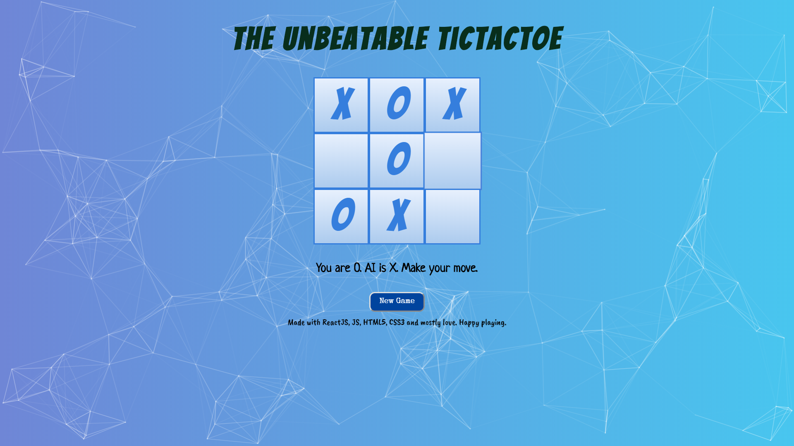
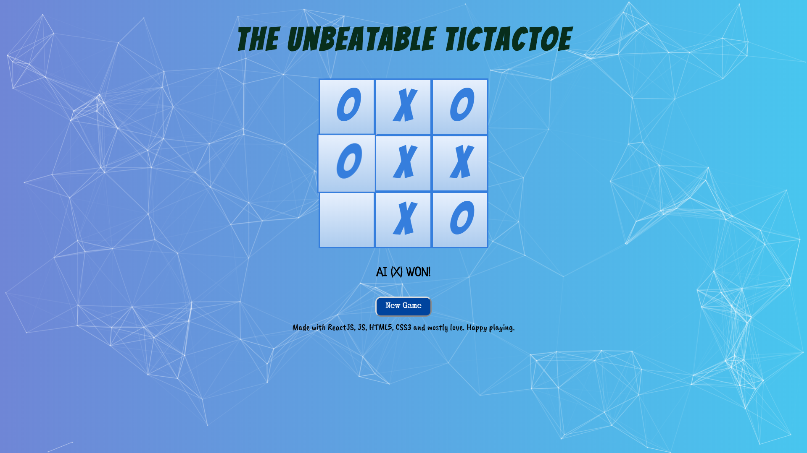

# Unbeatable TicTacToe
A simple game of tic-tac-toe using minimax algorithm in which the game predicts  move such that player can never beat it i.e either the game ends in a draw or a win for computer.
The front end of this project is built entirely in ReactJS.

##### Minimax Algorithm
Minimax is a recursive algorithm which is used to choose an optimal move for a player assuming that the other player is also playing optimally. It is similar to how we think when we play a game: "if I make this move, then my opponent can only make only these moves,” and so on. Minimax is called so because it helps in minimizing the loss when the other player chooses the strategy having the maximum loss.
In this project, we can further improve the algorithm by implementing alpha-beta pruning which will allow the game to make moves which will play the best moves such that the game ends as soon as possible.

# Installation and Setup Instructions
Clone down this repository. You will need `node` and `npm` installed globally on your machine.  

##### Installation:
`npm install`  

##### To Start Server:
`npm start`  
##### To Visit App: 
`localhost:3000`

# Screenshots

