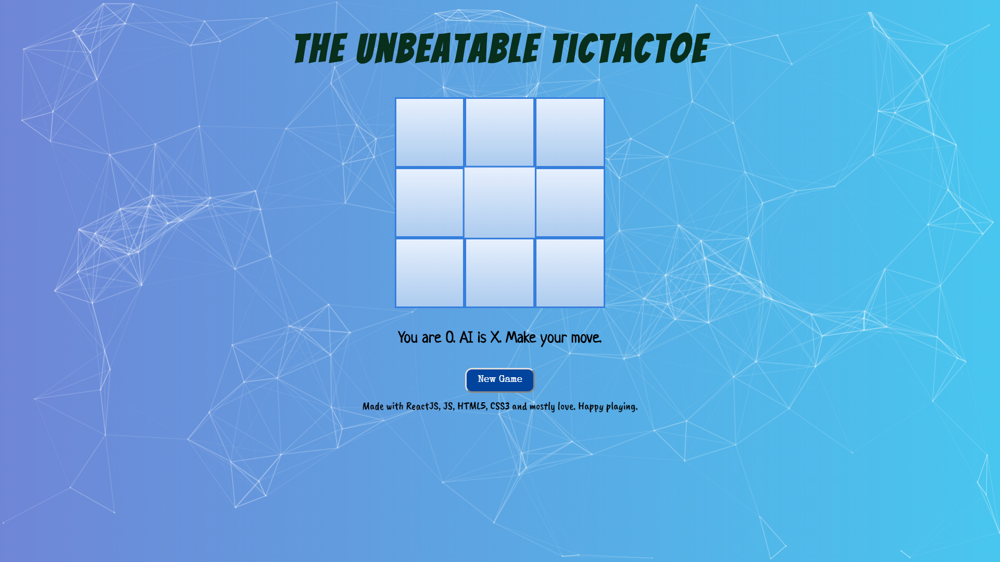

# Unbeatable TicTacToe

A simple game of tic-tac-toe using minimax algorithm in which the game predicts a move such that player can never beat it i.e either the game ends in a draw or a win for computer.
The front end of this project is built entirely in ReactJS.

# Installation and Setup Instructions
Clone down this repository. You will need `node` and `npm` installed globally on your machine.  

##### Installation:
`npm install`  

##### To Start Server:
`npm start`  
##### To Visit App: 
`localhost:3000`

# Screenshots

